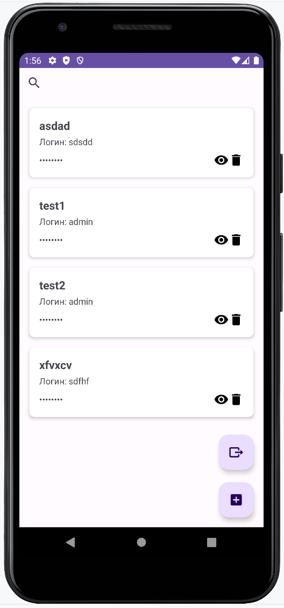

# NewPasswordManager
### by Wizand0

The application is completely offline and does not require permissions to access the network.

## Functionality:

Storing passwords with website, login, and password details.
Password generation with character customization.
Database encryption.
Login using a master password or biometrics.
Exporting records to a file.
Searching for passwords by login.

**Ru-ru**
1. Безопасное хранение паролей: С использованием Room и SQLCipher для зашифрованной базы данных.
2. Аутентификация: Вход по мастер-паролю или биометрии.
3. Удобный интерфейс: Поддержка поиска, добавления, редактирования и удаления записей.
4. Генерация паролей: Возможность создания надежных паролей с настройками типов символов.
5. Экспорт данных: Сохранение записей в файл CSV для резервного копирования или переноса данных.

End 7.5

v1.0 - Basic functionality.

## Screenshots

Adding lists           |         Adding elements
:-------------------------:|:------------------------------:
  | 

Sharing        |  Searching bar
:-------------------------:|:------------------------------:
 |  

## TODO
- ~~Searchbar for elements in list~~
- Edit passwords
- Tests
- Custom fields for data entry
- beautiful and user-friendly UI

## Very long-term TODO
- exporting a database
- importing a database
- **Changing master-password**: Реализуйте возможность изменения мастер-пароля с перенаправлением и безопасным обновлением базы данных.
- **Backup**: Интеграция с облачными сервисами для автоматического резервного копирования данных.
- **Localization**: Поддержка нескольких языков для удобства пользователей из разных регионов.
- **Privacy and security**: Включение механизма блокировки приложения после нескольких неудачных попыток аутентификации.

## Skills
- Kotlin
- SharedPreferences
- BiometricPrompt
- Room Database
- SQLCipher: для шифрования базы данных.
- Jetpack Security: для безопасного хранения мастер-пароля.
- BiometricPrompt: для биометрической аутентификации.
- Kotlin Coroutines: для асинхронных операций.
- ViewModel и LiveData: для управления данными и обновления UI.
- Navigation Component: для навигации между экранами.

## Versions
- v1.0 - Basic functionality
- v0.9b - Basic functionality
- v0.5b - Basic functionality

## Полезные ресурсы

- [Документация Room](https://developer.android.com/training/data-storage/room)
- [Документация SQLCipher](https://www.zetetic.net/sqlcipher/sqlcipher-for-android/)
- [Документация Biometric Authentication](https://developer.android.com/training/sign-in/biometric-auth)
- [Android Jetpack Security](https://developer.android.com/jetpack/androidx/releases/security)
- [Storage Access Framework](https://developer.android.com/guide/topics/providers/document-provider)
